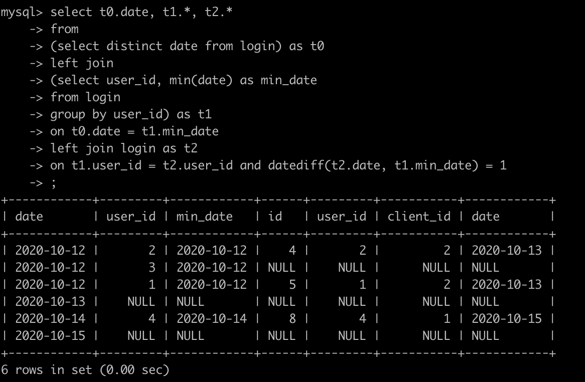

# 牛客网
[SQL1 查找最晚入职员工的所有信息](https://www.nowcoder.com/practice/218ae58dfdcd4af195fff264e062138f?tpId=82&tqId=29753&rp=1&ru=/exam/oj&qru=/exam/oj&sourceUrl=%2Fexam%2Foj%3Ftab%3DSQL%25E7%25AF%2587%26topicId%3D82%26page%3D1&difficulty=undefined&judgeStatus=undefined&tags=&title=)

```sql
select * from employees 
    order by hire_date desc 
    limit 1;

/* 使用limit 与 offset关键字  */
select * from employees 
    order by hire_date desc 
    limit 1 offset 0;

/* 使用limit关键字 从第0条记录 向后读取一个，也就是第一条记录 */
select * from employees 
    order by hire_date desc 
    limit 0,1;

/* 使用子查询，最后一天的时间有多个员工信息 */
select * from employees
    where hire_date = (select max(hire_date) from employees);

```

[SQL2 查找入职员工时间排名倒数第三的员工所有信息](https://www.nowcoder.com/practice/ec1ca44c62c14ceb990c3c40def1ec6c?tpId=82&tqId=29754&rp=1&ru=/exam/oj&qru=/exam/oj&sourceUrl=%2Fexam%2Foj%3Ftab%3DSQL%25E7%25AF%2587%26topicId%3D82%26page%3D1&difficulty=undefined&judgeStatus=undefined&tags=&title=)
```sql
select * from employees
where hire_date = 
(select distinct hire_date from employees 
order by hire_date desc
limit 1 offset 2);


select * from employees
where hire_date = 
(select hire_date from employees
group by hire_date 
order by hire_date desc 
limit 1 offset 2);
```
- 考虑到入职时间可能有相同的，所以需要用 **distinct** 或者 **group by** 去重。

[SQL3 查找当前薪水详情以及部门编号dept_no](https://www.nowcoder.com/practice/c63c5b54d86e4c6d880e4834bfd70c3b?tpId=82&rp=1&ru=%2Fexam%2Foj&qru=%2Fexam%2Foj&sourceUrl=%2Fexam%2Foj%3Ftab%3DSQL%25E7%25AF%2587%26topicId%3D82%26page%3D1&difficulty=&judgeStatus=&tags=&title=&gioEnter=menu)
```sql
select d.emp_no, s.salary, s.from_date, s.to_date, d.dept_no 
from dept_manager as d 
left join salaries as s
on d.emp_no = s.emp_no
where d.to_date = '9999-01-01' and s.to_date = '9999-01-01'
order by s.emp_no;
```

- 注意领导表里面可能还会存在**曾经的领导**，所以还需要限制to_date条件。

[SQL 4 查找所有已经分配部门的员工的last_name和first_name以及dept_no](https://www.nowcoder.com/practice/6d35b1cd593545ab985a68cd86f28671?tpId=82&rp=1&ru=%2Fexam%2Foj&qru=%2Fexam%2Foj&sourceUrl=%2Fexam%2Foj%3Ftab%3DSQL%25E7%25AF%2587%26topicId%3D82%26page%3D1&difficulty=&judgeStatus=&tags=&title=&gioEnter=menu)
```sql
select e.last_name, e.first_name, d.dept_no 
from dept_emp as d
left join employees as e
on d.emp_no = e.emp_no;
```
- 因为查询的是已经分配部门的员工，所以以**部门表作为左表**进行连接。

[SQL5 查找所有员工的last_name和first_name以及对应部门编号dept_no](https://www.nowcoder.com/practice/dbfafafb2ee2482aa390645abd4463bf?tpId=82&rp=1&ru=%2Fexam%2Foj&qru=%2Fexam%2Foj&sourceUrl=%2Fexam%2Foj%3Ftab%3DSQL%25E7%25AF%2587%26topicId%3D82%26page%3D1&difficulty=&judgeStatus=&tags=&title=&gioEnter=menu)
```sql
select e.last_name, e.first_name, d.dept_no
from employees as e 
left join dept_emp as d
on e.emp_no = d.emp_no;
```

- 与上题的区别在于**没有分配部门的员工也要输出来**，所以以员工表为左表连接。

[SQL7 查找薪水记录超过15次的员工号emp_no以及其对应的记录次数t](https://www.nowcoder.com/practice/6d4a4cff1d58495182f536c548fee1ae?tpId=82&rp=1&ru=%2Fexam%2Foj&qru=%2Fexam%2Foj&sourceUrl=%2Fexam%2Foj%3Ftab%3DSQL%25E7%25AF%2587%26topicId%3D82&difficulty=&judgeStatus=&tags=&title=&gioEnter=menu)

```sql
select emp_no, count(*) as t 
from salaries
group by emp_no
having t > 15;
```

[SQL8 找出所有员工当前薪水salary情况](nowcoder.com/practice/ae51e6d057c94f6d891735a48d1c2397?tpId=82&rp=1&ru=%2Fexam%2Foj&qru=%2Fexam%2Foj&sourceUrl=%2Fexam%2Foj%3Ftab%3DSQL%25E7%25AF%2587%26topicId%3D82&difficulty=&judgeStatus=&tags=&title=&gioEnter=menu)
```sql
select distinct salary from salaries
order by salary desc;
```

[SQL10 获取所有非manager的员工emp_no](https://www.nowcoder.com/practice/32c53d06443346f4a2f2ca733c19660c?tpId=82&rp=1&ru=%2Fexam%2Foj&qru=%2Fexam%2Foj&sourceUrl=%2Fexam%2Foj%3Ftab%3DSQL%25E7%25AF%2587%26topicId%3D82&difficulty=&judgeStatus=&tags=&title=&gioEnter=menu)

```sql
select emp_no from employees 
where emp_no not in 
(select emp_no from dept_manager);

select e.emp_no 
from employees as e
left join dept_manager as d
on e.emp_no = d.emp_no
where d.dept_no is null;
```

- 可以使用 not in 或者 left join。

[SQL11 获取所有员工当前的manager](https://www.nowcoder.com/practice/e50d92b8673a440ebdf3a517b5b37d62?tpId=82&rp=1&ru=%2Fexam%2Foj&qru=%2Fexam%2Foj&sourceUrl=%2Fexam%2Foj%3Ftab%3DSQL%25E7%25AF%2587%26topicId%3D82&difficulty=&judgeStatus=&tags=&title=&gioEnter=menu)

```sql
select d.emp_no, m.emp_no as manager
from dept_emp as d
left join dept_manager as m
on d.dept_no = m.dept_no
where d.emp_no <> manager and m.to_date = '9999-01-01';
```

- 注意：**以下的 sql 中为了可读性都省略了 to_date, 实际中 to_date 保证了当前员工没有离职，并且是最新的工资数据(因为可能存在升职加薪的情况)应该加上**。

[SQL12 获取每个部门中当前员工薪水最高的相关信息]()
- 错误写法
误区：使用GROUP BY子句后，select 语句中只能出现**group by语句中出现的字段，或者聚合函数，或者常数**，所以这里无法同时出现dept_no,emp_no.
(mysql语法松散，允许出现select语句中出现group by语句未出现的字段，但这样展示没有意义，因为记录并没有对应，默认取第一条，所以可能出现对应错误。
```sql
/*select d.dept_no, d.emp_no, max(s.salary) as maxSalary
from dept_emp as d
join salaries as s
on d.emp_no = s.emp_no
group by d.dept_no
order by d.dept_no
*/
```

```sql
select uni.dept_no, uni.emp_no, uni.salary
from 
(select d.dept_no, d.emp_no, s.salary 
from dept_emp as d
join salaries as s
on d.emp_no = s.emp_no) as uni /*部门编号 员工编号 薪水*/
join 
(select d.dept_no, max(s.salary) as maxSalary
from dept_emp as d
join salaries as s
on d.emp_no = s.emp_no
group by d.dept_no) as ms /*部门编号 最大薪水*/
on uni.dept_no = ms.dept_no and uni.salary = ms.maxSalary 
order by uni.dept_no;
```

[SQL15 查找employees表emp_no与last_name的员工信息](https://www.nowcoder.com/practice/a32669eb1d1740e785f105fa22741d5c?tpId=82&rp=1&ru=%2Fexam%2Foj&qru=%2Fexam%2Foj&sourceUrl=%2Fexam%2Foj%3Ftab%3DSQL%25E7%25AF%2587%26topicId%3D82&difficulty=&judgeStatus=&tags=&title=&gioEnter=menu)
```sql
select * from employees
where emp_no & 1 and last_name <> 'Mary'
order by hire_date desc;
```

- 本题要保留 emp_no 是**奇数**的，可以**使用 & 运算符号**。(或者使用 mod(emp_no, 2) = 1， 但是某些 sql 版本可能没有这个函数)

[SQL16 统计出当前各个title类型对应的员工当前薪水对应的平均工资](https://www.nowcoder.com/practice/c8652e9e5a354b879e2a244200f1eaae?tpId=82&rp=1&ru=%2Fexam%2Foj&qru=%2Fexam%2Foj&sourceUrl=%2Fexam%2Foj%3Ftab%3DSQL%25E7%25AF%2587%26topicId%3D82&difficulty=&judgeStatus=&tags=&title=&gioEnter=menu)

```sql
select t.title, avg(s.salary) 
from titles as t
join salaries as s
on t.emp_no = s.emp_no
group by t.title
order by avg(s.salary);
```

[SQL17 获取当前薪水第二多的员工的emp_no以及其对应的薪水salary](https://www.nowcoder.com/practice/8d2c290cc4e24403b98ca82ce45d04db?tpId=82&rp=1&ru=%2Fexam%2Foj&qru=%2Fexam%2Foj&sourceUrl=%2Fexam%2Foj%3Ftab%3DSQL%25E7%25AF%2587%26topicId%3D82&difficulty=&judgeStatus=&tags=&title=&gioEnter=menu)
```sql
select emp_no, salary from salaries 
where salary = 
(select distinct salary from salaries
 order by salary desc 
limit 1 offset 1 /*从 1 开始，取一个*/) 
order by emp_no;
```

[SQL18 获取当前薪水第二多的员工的emp_no以及其对应的薪水salary](https://www.nowcoder.com/practice/c1472daba75d4635b7f8540b837cc719?tpId=82&rp=1&ru=%2Fexam%2Foj&qru=%2Fexam%2Foj&sourceUrl=%2Fexam%2Foj%3Ftab%3DSQL%25E7%25AF%2587%26topicId%3D82&difficulty=&judgeStatus=&tags=&title=&gioEnter=menu)
```sql
select e.emp_no, s.salary, e.last_name, e.first_name
from employees as e
join salaries as s
on e.emp_no = s.emp_no
where salary = 
(select max(salary) from salaries
where salary < 
(select max(salary) from salaries))
```
- 本题目不允许使用 order by，还需要排名工资第二高的员工信息，所以可以先找最高的 salary，再找第二高的 salary。

[SQL19 查找所有员工的last_name和first_name以及对应的dept_name](https://www.nowcoder.com/practice/5a7975fabe1146329cee4f670c27ad55?tpId=82&rp=1&ru=%2Fexam%2Foj&qru=%2Fexam%2Foj&sourceUrl=%2Fexam%2Foj%3Ftab%3DSQL%25E7%25AF%2587%26topicId%3D82&difficulty=&judgeStatus=&tags=&title=&gioEnter=menu)

```sql
select e.last_name, e.first_name, d.dept_name
from employees as e
left join dept_emp as de
on e.emp_no = de.emp_no
left join departments as d
on de.dept_no = d.dept_no
```
- 三表连接。因为没有分配 dept 的员工也要出现，所以以 employees 作为主表进行左连接。

[SQL21 查找在职员工自入职以来的薪水涨幅情况](https://www.nowcoder.com/practice/fc7344ece7294b9e98401826b94c6ea5?tpId=82&rp=1&ru=%2Fexam%2Foj&qru=%2Fexam%2Foj&sourceUrl=%2Fexam%2Foj%3Ftab%3DSQL%25E7%25AF%2587%26topicId%3D82&difficulty=&judgeStatus=&tags=&title=&gioEnter=menu)

```sql
select pre.emp_no, (now.salary - pre.salary) as growth
from 
/*入职薪水*/
(select e.emp_no, s.salary
from employees as e
join salaries as s
on e.emp_no = s.emp_no 
and e.hire_date = s.from_date) as pre
join 
/*当前薪水*/
(select s.emp_no, s.salary
from salaries as s
where s.to_date = '9999-01-01') as now
on pre.emp_no = now.emp_no
order by growth;
```
- 获取入职薪水和当前薪水相减即可。

[SQL22 统计各个部门的工资记录数](https://www.nowcoder.com/practice/6a62b6c0a7324350a6d9959fa7c21db3?tpId=82&rp=1&ru=%2Fexam%2Foj&qru=%2Fexam%2Foj&sourceUrl=%2Fexam%2Foj%3Ftab%3DSQL%25E7%25AF%2587%26topicId%3D82&difficulty=&judgeStatus=&tags=&title=&gioEnter=menu)

```sql
select d.dept_no, d.dept_name, count(*) as sum
from departments as d
join dept_emp as de
on d.dept_no = de.dept_no
join salaries as s
on de.emp_no = s.emp_no
group by d.dept_no, d.dept_name
order by d.dept_no
```

[SQL23 对所有员工的薪水按照salary降序进行1-N的排名](https://www.nowcoder.com/practice/b9068bfe5df74276bd015b9729eec4bf?tpId=82&rp=1&ru=%2Fexam%2Foj&qru=%2Fexam%2Foj&sourceUrl=%2Fexam%2Foj%3Ftab%3DSQL%25E7%25AF%2587%26topicId%3D82&difficulty=&judgeStatus=&tags=&title=&gioEnter=menu)

```sql
select emp_no, salary, dense_rank() over(order by salary desc) as rank
from salaries
order by rank, emp_no
```
- RANK()
    - 在计算排序时，若**存在相同位次，会跳过之后的位次**。
    - 例如，有3条排在第1位时，排序为：1，1，1，4······

- DENSE_RANK()
    - 这就是题目中所用到的函数，在计算排序时，若**存在相同位次，不会跳过之后的位次**。
    - 例如，有3条排在第1位时，排序为：1，1，1，2······

- ROW_NUMBER()
    - 这个函数赋予**唯一的连续位次**。
    - 例如，有3条排在第1位时，排序为：1，2，3，4······

- 窗口函数用法：
<窗口函数> OVER ( [PARTITION BY <列清单> ]
                                ORDER BY <排序用列清单> ）
*其中[ ]中的内容可以忽略

[SQL24 获取所有非manager员工当前的薪水情况](https://www.nowcoder.com/practice/8fe212a6c71b42de9c15c56ce354bebe?tpId=82&rp=1&ru=%2Fexam%2Foj&qru=%2Fexam%2Foj&sourceUrl=%2Fexam%2Foj%3Ftab%3DSQL%25E7%25AF%2587%26topicId%3D82&difficulty=&judgeStatus=&tags=&title=&gioEnter=menu)

```sql
select de.dept_no, e.emp_no, s.salary
from employees as e
join dept_emp as de
on e.emp_no = de.emp_no
join salaries as s
on s.emp_no = e.emp_no
where e.emp_no not in (select emp_no from dept_manager)

select de.dept_no, e.emp_no, s.salary
from employees as e
join dept_emp as de
on e.emp_no = de.emp_no
join salaries as s
on s.emp_no = e.emp_no
left join dept_manager as dm
on e.emp_no = dm.emp_no
where dm.emp_no is null
```

- 第一种写法是正常的使用 not in 去掉 manager 的 emp_no。第二种可以使用左连接，由于 manager 表只有 manager 的 emp_no, 所以在连接的过程中会有 null 的情况，为 null 的就是所有不是 manager 的员工。

[SQL25 获取员工其当前的薪水比其manager当前薪水还高的相关信息](https://www.nowcoder.com/practice/f858d74a030e48da8e0f69e21be63bef?tpId=82&rp=1&ru=%2Fexam%2Foj&qru=%2Fexam%2Foj&sourceUrl=%2Fexam%2Foj%3Ftab%3DSQL%25E7%25AF%2587%26topicId%3D82&difficulty=&judgeStatus=&tags=&title=&gioEnter=menu)
```sql
select ss.emp_no, m.emp_no as manager_no,
ss.salary as emp_salary, m.salary as manager_salary
from
/*员工 的工资*/
(select s.emp_no, s.salary, de.dept_no
from salaries as s
join dept_emp as de
on s.emp_no = de.emp_no) as ss
join 
/*manager 的工资*/
(select dm.dept_no, dm.emp_no, s.salary
from dept_manager as dm
join salaries as s
on dm.emp_no = s.emp_no) as m
on ss.dept_no = m.dept_no
where emp_salary > manager_salary;
```
- 步骤分开，分别击破

[SQL26 汇总各个部门当前员工的title类型的分配数目](https://www.nowcoder.com/practice/4bcb6a7d3e39423291d2f7bdbbff87f8?tpId=82&rp=1&ru=%2Fexam%2Foj&qru=%2Fexam%2Foj&sourceUrl=%2Fexam%2Foj%3Ftab%3DSQL%25E7%25AF%2587%26topicId%3D82&difficulty=&judgeStatus=&tags=&title=&gioEnter=menu)

```sql
select d.dept_no, d.dept_name, t.title, count(*)
from titles as t
join dept_emp as de
on t.emp_no = de.emp_no
join departments as d
on de.dept_no = d.dept_no
group by d.dept_no, d.dept_name, t.title
order by d.dept_no, t.title
```

[SQL29 使用join查询方式找出没有分类的电影id以及名称](https://www.nowcoder.com/practice/a158fa6e79274ac497832697b4b83658?tpId=82&rp=1&ru=%2Fexam%2Foj&qru=%2Fexam%2Foj&sourceUrl=%2Fexam%2Foj%3Ftab%3DSQL%25E7%25AF%2587%26topicId%3D82&difficulty=&judgeStatus=&tags=&title=&gioEnter=menu)
```sql
select f.film_id, f.title 
from film as f
left join film_category as fc
on f.film_id = fc.film_id
where fc.category_id is null
```

- 跟 null 比较的时候需要用 is null 和 is not null。

[SQL30 使用子查询的方式找出属于Action分类的所有电影对应的title,description](https://www.nowcoder.com/practice/2f2e556d335d469f96b91b212c4c203e?tpId=82&rp=1&ru=%2Fexam%2Foj&qru=%2Fexam%2Foj&sourceUrl=%2Fexam%2Foj%3Ftab%3DSQL%25E7%25AF%2587%26topicId%3D82&difficulty=&judgeStatus=&tags=&title=&gioEnter=menu)

```sql
select f.title, f.description
from film as f
where f.film_id in 
(select fc.film_id 
from film_category as fc
join category as c
on fc.category_id = c.category_id
where c.name = 'Action')
```
- 练习子查询。

[SQL32 将employees表的所有员工的last_name和first_name拼接起来作为Name](https://www.nowcoder.com/practice/6744b90bbdde40209f8ecaac0b0516fe?tpId=82&rp=1&ru=%2Fexam%2Foj&qru=%2Fexam%2Foj&sourceUrl=%2Fexam%2Foj%3Ftab%3DSQL%25E7%25AF%2587%26topicId%3D82&difficulty=&judgeStatus=&tags=&title=&gioEnter=menu)
```sql
/*sqlite 用 || 拼接*/
select last_name || " " || first_name as name from employees

/*mysql 用 concat*/
select concat(last_name, " ", first_name) as name from employees;
```

[SQL33 创建一个actor表，包含如下列信息](https://www.nowcoder.com/practice/ac233de508ef4849b0eeb4f38dcf09cf?tpId=82&tqId=29801&rp=1&ru=/exam/oj&qru=/exam/oj&sourceUrl=%2Fexam%2Foj%3Ftab%3DSQL%25E7%25AF%2587%26topicId%3D82%26page%3D1&difficulty=undefined&judgeStatus=undefined&tags=&title=)
```sql
create table actor
(actor_id smallint(5) not null primary key,
 first_name varchar(45) not null,
 last_name varchar(45) not null,
 last_update date not null
);
```
- 创建表
    - CREATE [TEMPORARY] TABLE[ IF NOT EXISTS] [库名.]表名 ( 表的结构定义 )[ 表选项]
        - 每个字段必须有数据类型
        - 最后一个字段后不能有逗号
        - TEMPORARY 临时表，会话结束时表自动消失
        - 对于字段的定义：
            - 字段名 数据类型 [NOT NULL | NULL] [DEFAULT default_value] [AUTO_INCREMENT] [UNIQUE [KEY] | [PRIMARY] KEY] [COMMENT 'string']
- 表选项
    - 字符集
        - CHARSET = charset_name
        - 如果表没有设定，则使用数据库字符集
    - 存储引擎
        - ENGINE = engine_name
        - 表在管理数据时采用的不同的数据结构，结构不同会导致处理方式、提供的特性操作等不同
        - 常见的引擎：InnoDB MyISAM Memory/Heap BDB Merge Example CSV MaxDB Archive
        - 不同的引擎在保存表的结构和数据时采用不同的方式
        MyISAM表文件含义：.frm表定义，.MYD表数据，.MYI表索引
        InnoDB表文件含义：.frm表定义，表空间数据和日志文件
        - SHOW ENGINES -- 显示存储引擎的状态信息
        - SHOW ENGINE 引擎名 {LOGS|STATUS} -- 显示存储引擎的日志或状态信息
    - 自增起始数
    	AUTO_INCREMENT = 行数
    - 数据文件目录
        DATA DIRECTORY = '目录'
    - 索引文件目录
        INDEX DIRECTORY = '目录'
    - 表注释
        COMMENT = 'string'
    - 分区选项
        PARTITION BY ... (详细见手册)

[SQL34 批量插入数据](                              )
```sql
insert into actor VALUES
(1, 'PENELOPE', 'GUINESS', '2006-02-15 12:34:33'),
(2, 'NICK', 'WAHLBERG', '2006-02-15 12:34:33');
```

- 增
    - INSERT [INTO] 表名 [(字段列表)] VALUES (值列表)[, (值列表), ...]
        - 如果要插入的值列表包含所有字段并且顺序一致，则可以省略字段列表。
        - 可同时插入多条数据记录！
        REPLACE 与 INSERT 完全一样，可互换。
    - INSERT [INTO] 表名 SET 字段名=值[, 字段名=值, ...]
- mysql 中常见的三种插入数据的语句:
    - insert into 表示插入数据，数据库会**检查主键，如果出现重复会报错**；
    - replace into 表示插入替换数据，如果数据库已经存在数据，则**用新数据替换**，如果没有数据效果则和 insert into 一样；
    - insert ignore 表示，如果中已经存在相同的记录，则**忽略当前新数据**；

[SQL35 批量插入数据，不使用replace操作](https://www.nowcoder.com/practice/153c8a8e7805400ba8e384e03acc6b3e?tpId=82&rp=1&ru=%2Fexam%2Foj&qru=%2Fexam%2Foj&sourceUrl=%2Fexam%2Foj%3Ftab%3DSQL%25E7%25AF%2587%26topicId%3D82%26page%3D1&difficulty=&judgeStatus=&tags=&title=&gioEnter=menu)
```sql
insert ignore into actor values
('3', 'ED', 'CHASE', '2006-02-15 12:34:33');
```

[SQL36 创建一个actor_name表](https://www.nowcoder.com/practice/881385f388cf4fe98b2ed9f8897846df?tpId=82&tqId=29804&rp=1&ru=/exam/oj&qru=/exam/oj&sourceUrl=%2Fexam%2Foj%3Ftab%3DSQL%25E7%25AF%2587%26topicId%3D82%26page%3D1&difficulty=undefined&judgeStatus=undefined&tags=&title=)

本题目考察MYSQL创建数据表的三种方法：

- 常规创建
create table if not exists 目标表
- 复制表格
create 目标表 like 来源表
- 将table1的部分拿来创建table2

```sql
CREATE TABLE actor_name    -- 创建表
(first_name varchar(45) NOT NULL,
 last_name varchar(45) NOT NULL);
 
INSERT INTO actor_name  -- 插入数据
SELECT first_name,last_name
FROM actor;
```

[SQL37 对first_name创建唯一索引uniq_idx_firstname](https://www.nowcoder.com/practice/e1824daa0c49404aa602cf0cb34bdd75?tpId=82&rp=1&ru=%2Fexam%2Foj&qru=%2Fexam%2Foj&sourceUrl=%2Fexam%2Foj%3Ftab%3DSQL%25E7%25AF%2587%26topicId%3D82%26page%3D1&difficulty=&judgeStatus=&tags=&title=&gioEnter=menu)

```sql
alter table actor add unique uniq_idx_firstname(first_name);
alter table actor add index idx_lastname(last_name);
```

[Mysql 索引详解](https://javaguide.cn/database/mysql/mysql-index/#)
- 什么是索引？作用?
    - 索引是一种用于**快速查询**和**检索数据**的数据结构。
- 优缺点:
    - 优点: 
        - 大大**加快**数据的检索**速度**(大大减少数据检索量)
        - 通过创建**唯一性索引**，可以保证数据库中的每一行数据的**唯一性**
    - 缺点:
        - **创建**和**维护**索引需要耗费许多时间。增删改的时候，索引动态修改，影响 SQL 执行效率。
        - 索引也需要**物理文件储存**。
- 索引一定带来速度提升吗？
    - 跟数据库的大小有关，数据量不大，也不一定带来提升。
- 索引的数据结构：
    - Hash 表：键值对的集合，通过 hash 算法快速找到 value 对应的 index，找到 index 也就找到了 value。
        - hash 冲突:
            - 拉链法
            - 开放寻址法
        - mysql 为什么不用 Hash 表？
            - hash 冲突
            - 不支持**顺序查询和范围查询**
    - B & B+ 树
        - 异同：
            - B 树的所有节点既存放 key 也存放 data，B+ 树只有**叶子节点**存放 key 和 data，其他节点只存放 key。
            - B 树的叶子节点是**独立**的；B+ 树的叶子节点有一条**引用链**指向与它相邻的叶子节点(双向链表)。
            - B 树在每个节点都有可能查到数据，效率不稳定；B+树必须查到叶子节点，效率稳定。
- 聚集索引与非聚集索引:
    - 聚集索引: 数据页会按照 index 建立的方式排序. (就像字典的字母序目录一样)，**只能有一个**
        - 优点: **区间搜索**高效；由于磁盘在顺序读取时有预读取(prefetching) 机制，所以会有 potential locality benefits
        - 缺点: **依赖有序的数据页**，需要在插入的时候排序；**维护更新**代价大
    - 非聚集索引: 数据页没有按照 index 建立的方式排序。可以建立**很多个**。
        - 优点: 更新代价比聚集索引小。
        - 缺点: **可能会二次查询(回表)**：当查到索引对应的指针或者主键后，可能还需要回到数据文件或者表中查询。
- 索引类型:
    - 主键索引(Primary Key): 数据表的主键列使用的就是主键索引。**只能有一个主键，且不能为 NULL， 不能重复**。
    - 二级索引(辅助索引): 二级索引的叶子节点**存储的数据是主键**。通过二级索引，可以定位主键的位置。
        - 唯一索引(Unique Key): **唯一索引也是一种约束。唯一索引的属性列不能出现重复的数据，但是允许数据为 NULL，一张表允许创建多个唯一索引。** 建立唯一索引的目的大部分时候都是为了该属性列的数据的唯一性，而不是为了查询效率。
        - 普通索引(Index): **普通索引的唯一作用就是为了快速查询数据，一张表允许创建多个普通索引，并允许数据重复和 NULL。**
        - 前缀索引(Prefix) 
        - 全文索引(Full Text) 
- 索引注意事项:
    - 选择合适字段:
        - 尽量不为 NULL
        - 频繁查询的字段
        - 被作为条件查询的字段
        - 频繁排序的字段
        - 频繁连接的字段
    - **频繁更新字段**谨慎建立索引
    - 尽可能**联合索引**(多个字段在一个索引上)
    - 避免索引冗余
    - 在字符串类型的字段上使用**前缀索引代替普通索引**
- 如何添加索引
    - 主键索引:
    ```sql
    ALTER TABLE `table_name` ADD PRIMARY KEY ( `column` )
    ```
    - 唯一索引:
    ```sql
    ALTER TABLE `table_name` ADD UNIQUE ( `column` )
    ```
    - 普通索引:
    ```sql
    ALTER TABLE `table_name` ADD INDEX index_name ( `column` )
    ```
    - 全文索引:
    ```sql
    ALTER TABLE `table_name` ADD FULLTEXT ( `column`)
    ```
    - 多列索引:
    ```sql
    ALTER TABLE `table_name` ADD INDEX index_name ( `column1`, `column2`, `column3` )
    ```

[SQL38 针对actor表创建视图actor_name_view](https://www.nowcoder.com/practice/b9db784b5e3d488cbd30bd78fdb2a862?tpId=82&rp=1&ru=%2Fexam%2Foj&qru=%2Fexam%2Foj&sourceUrl=%2Fexam%2Foj%3Ftab%3DSQL%25E7%25AF%2587%26topicId%3D82%26page%3D1&difficulty=&judgeStatus=&tags=&title=&gioEnter=menu)

```sql
create view actor_name_view (first_name_v, last_name_v) 
as select first_name, last_name from actor;
```

- 什么是视图：
    - 视图是一个**虚拟表，其内容由查询定义**。同真实的表一样，视图包含一系列带有名称的列和行数据。但是，视图并不在数据库中以存储的数据值集形式存在。行和列数据来自由定义视图的查询所引用的表，并且**在引用视图时动态生成**。
    - 视图**具有表结构文件，但不存在数据文件**。
    - 对其中所引用的基础表来说，视图的作用类似于**筛选**。定义视图的筛选可以来自当前或其它数据库的一个或多个表，或者其它视图。通过视图进行查询没有任何限制，通过它们进行数据修改时的限制也很少。
    - 视图是**存储在数据库中的查询的sql语句**，它主要出于两种原因：**安全原因**，视图可以隐藏一些数据，如：社会保险基金表，可以用视图只显示姓名，地址，而不显示社会保险号和工资数等，另一原因是**可使复杂的查询易于理解和使用**。
- 创建视图
    ```sql
    CREATE [OR REPLACE] [ALGORITHM = {UNDEFINED | MERGE | TEMPTABLE}] 
    VIEW view_name [(column_list)] AS select_statement
    ``` 
    - 视图名必须唯一，同时不能与表重名。
    - 视图可以使用select语句查询到的列名，也可以自己指定相应的列名。
    - 可以指定视图执行的算法，通过ALGORITHM指定。
    - column_list如果存在，则数目必须等于SELECT语句检索的列数

- 查看结构
    ```sql
    SHOW CREATE VIEW view_name
    ```
- 删除视图
    - 删除视图后，数据依然存在。
    - 可同时删除多个视图。
    ```sql
    DROP VIEW [IF EXISTS] view_name ...
    ```
- 修改视图结构
    - 一般不修改视图，因为不是所有的更新视图都会映射到表上。
    ```sql
    ALTER VIEW view_name [(column_list)] AS select_statement
    ```
- 视图作用
    - 简化业务逻辑
    - 对客户端隐藏真实的表结构
- 视图算法(ALGORITHM)
    - MERGE       合并
        将视图的查询语句，与外部查询需要先合并再执行！
    - TEMPTABLE   临时表
        将视图执行完毕后，形成临时表，再做外层查询！
    - UNDEFINED   未定义(默认)，指的是MySQL自主去选择相应的算法。

[SQL39 针对上面的salaries表emp_no字段创建索引idx_emp_no 并强制使用索引](https://www.nowcoder.com/practice/f9fa9dc1a1fc4130b08e26c22c7a1e5f?tpId=82&tqId=29807&rp=1&ru=/exam/oj&qru=/exam/oj&sourceUrl=%2Fexam%2Foj%3Ftab%3DSQL%25E7%25AF%2587%26topicId%3D82&difficulty=undefined&judgeStatus=undefined&tags=&title=)
```sql
select * from salaries 
force index (idx_emp_no) /*强制使用索引*/
where emp_no = 10005;
```

[SQL40 在last_update后面新增加一列名字为create_date](https://www.nowcoder.com/practice/119f04716d284cb7a19fba65dd876b03?tpId=82&rp=1&ru=%2Fexam%2Foj&qru=%2Fexam%2Foj&sourceUrl=%2Fexam%2Foj%3Ftab%3DSQL%25E7%25AF%2587%26topicId%3D82&difficulty=&judgeStatus=&tags=&title=&gioEnter=menu)
```sql
alter table actor 
add column create_date datetime not null default '2020-10-01 00:00:00';
```

- 修改表的字段机构（13.1.2. ALTER TABLE语法）
    - ALTER TABLE 表名 操作名
        - 操作名
            - ADD[ COLUMN] 字段定义       -- 增加字段
                - AFTER 字段名          -- 表示增加在该字段名后面
                - FIRST               -- 表示增加在第一个
            - ADD PRIMARY KEY(字段名)   -- 创建主键
            - ADD UNIQUE [索引名] (字段名)-- 创建唯一索引
            - ADD INDEX [索引名] (字段名) -- 创建普通索引
            - DROP[ COLUMN] 字段名      -- 删除字段
            - MODIFY[ COLUMN] 字段名 字段属性     -- 支持对字段属性进行修改，**不能修改字段名**(所有原有属性也需写上)
            - CHANGE[ COLUMN] 原字段名 新字段名 字段属性      -- 支持**对字段名修改**
            - DROP PRIMARY KEY    -- 删除主键(删除主键前需删除其AUTO_INCREMENT属性)
            - DROP INDEX 索引名 -- 删除索引
            - DROP FOREIGN KEY 外键    -- 删除外键


[SQL41 构造一个触发器audit_log](https://www.nowcoder.com/practice/7e920bb2e1e74c4e83750f5c16033e2e?tpId=82&rp=1&ru=%2Fexam%2Foj&qru=%2Fexam%2Foj&sourceUrl=%2Fexam%2Foj%3Ftab%3DSQL%25E7%25AF%2587%26topicId%3D82&difficulty=&judgeStatus=&tags=&title=&gioEnter=menu)
```sql
create trigger audit_log
after insert on employees_test
for each row
begin
    insert into audit(emp_no, name) values(new.id, new.name);
end
```

- 创建触发器的语法:
```sql
CREATE TRIGGER trigger_name
trigger_time trigger_event ON tbl_name
FOR EACH ROW
trigger_stmt
```
其中：
- trigger_name：标识触发器名称，用户自行指定；
- trigger_time：标识触发时机，取值为 BEFORE 或 AFTER；
- trigger_event：标识触发事件，取值为 INSERT、UPDATE 或 DELETE；
- tbl_name：标识建立触发器的表名，即在哪张表上建立触发器；
- trigger_stmt：触发器程序体，可以是一句SQL语句，或者用 BEGIN 和 END 包含的多条语句，每条语句结束要分号结尾。

【NEW 与 OLD】 详解
MySQL 中定义了 NEW 和 OLD，用来表示触发器的所在表中，触发了触发器的那一行数据。
具体地：
- 在 INSERT 型触发器中，NEW 用来表示将要（BEFORE）或已经（AFTER）插入的新数据；
- 在 UPDATE 型触发器中，OLD 用来表示将要或已经被修改的原数据，NEW 用来表示将要或已经修改为的新数据；
- 在 DELETE 型触发器中，OLD 用来表示将要或已经被删除的原数据；
    - 使用方法： NEW.columnName （columnName 为相应数据表某一列名）

[SQL42 删除emp_no重复的记录，只保留最小的id对应的记录。](https://www.nowcoder.com/practice/3d92551a6f6d4f1ebde272d20872cf05?tpId=82&rp=1&ru=%2Fexam%2Foj&qru=%2Fexam%2Foj&sourceUrl=%2Fexam%2Foj%3Ftab%3DSQL%25E7%25AF%2587%26topicId%3D82&difficulty=&judgeStatus=&tags=&title=&gioEnter=menu)

```sql
delete from titles_test
where id not in
(select * from 
(select min(id) from titles_test 
group by emp_no) as t);
```
- **MySQL中不允许在子查询的同时删除表数据（不能一边查一边把查的表删了）**, 索引需要再套一层。

[SQL43 将所有to_date为9999-01-01的全部更新为NULL](https://www.nowcoder.com/practice/859f28f43496404886a77600ea68ef59?tpId=82&rp=1&ru=%2Fexam%2Foj&qru=%2Fexam%2Foj&sourceUrl=%2Fexam%2Foj%3Ftab%3DSQL%25E7%25AF%2587%26topicId%3D82&difficulty=&judgeStatus=&tags=&title=&gioEnter=menu)
```sql
update titles_test set to_date = null, from_date = '2001-01-01'
where to_date = '9999-01-01';
```

[SQL44 将id=5以及emp_no=10001的行数据替换成id=5以及emp_no=10005](https://www.nowcoder.com/practice/2bec4d94f525458ca3d0ebf3bc8cd240?tpId=82&rp=1&ru=%2Fexam%2Foj&qru=%2Fexam%2Foj&sourceUrl=%2Fexam%2Foj%3Ftab%3DSQL%25E7%25AF%2587%26topicId%3D82&difficulty=&judgeStatus=&tags=&title=&gioEnter=menu)
```sql
update titles_test 
set emp_no = replace(emp_no, 10001, 10005);
```

- 使用 replace 函数

[SQL45 将titles_test表名修改为titles_2017](https://www.nowcoder.com/practice/5277d7f92aa746ab8aa42886e5d570d4?tpId=82&rp=1&ru=%2Fexam%2Foj&qru=%2Fexam%2Foj&sourceUrl=%2Fexam%2Foj%3Ftab%3DSQL%25E7%25AF%2587%26topicId%3D82&difficulty=&judgeStatus=&tags=&title=&gioEnter=menu)

```sql
rename table titles_test to titles_2017;
```

[SQL46 在audit表上创建外键约束，其emp_no对应employees_test表的主键id](https://www.nowcoder.com/practice/aeaa116185f24f209ca4fa40e226de48?tpId=82&rp=1&ru=%2Fexam%2Foj&qru=%2Fexam%2Foj&sourceUrl=%2Fexam%2Foj%3Ftab%3DSQL%25E7%25AF%2587%26topicId%3D82&difficulty=&judgeStatus=&tags=&title=&gioEnter=menu)
```sql
alter table audit 
add constraint foreign key(emp_no)
references employees_test(id);
```
- 列属性（列约束）
    - PRIMARY 主键
        - 能**唯一标识记录**的字段，可以作为主键。
        - 一个表只能有**一个主键**。
        - 主键具有**唯一性**。
        - 声明字段时，用 primary key 标识。也可以在字段列表之后声明
            - 例：create table tab ( id int, stu varchar(10), primary key (id));
        - 主键字段的值**不能为null**。
        - 主键可以由**多个字段**共同组成。此时需要在**字段列表后声明**的方法。
            - 例：create table tab ( id int, stu varchar(10), age int, primary key (stu, age));
    - UNIQUE 唯一索引（唯一约束）
        - 使得某字段的值也**不能重复**（可以为 null）。
    - NULL 约束
        - null不是数据类型，是列的一个属性。
        - 表示当前列是否可以为null，表示什么都没有。
            - null, 允许为空。默认。
            - not null, 不允许为空。
                - insert into tab values (null, 'val');
                    此时表示将第一个字段的值设为null, 取决于该字段是否允许为null
    - DEFAULT 默认值属性
        - 当前字段的默认值。
        - insert into tab values (default, 'val');    -- 此时表示强制使用默认值。
        - create table tab ( add_time timestamp default current_timestamp );
        -- 表示将当前时间的时间戳设为默认值。
        current_date, current_time
    - AUTO_INCREMENT 自动增长约束
        - 自动增长**必须为索引**（**主键或unique**）
        - **只能存在一个**字段为自动增长。
        默认为1开始自动增长。可以通过表属性 auto_increment = x进行设置，或 alter table tbl auto_increment = x;
    - COMMENT 注释
        - 例：create table tab ( id int ) comment '注释内容';
    - FOREIGN KEY 外键约束
        - 用于**限制主表与从表数据完整性**。
        - alter table t1 add constraint `t1_t2_fk` foreign key (t1_id) references t2(id);
            - 将表t1的t1_id外键关联到表t2的id字段。
            - 每个外键都有一个名字，可以通过 constraint 指定
        - 存在外键的表，称之为从表（子表），外键指向的表，称之为主表（父表）。
        - 作用：保持数据一致性，完整性，主要目的是控制存储在外键表（从表）中的数据。
        - MySQL中，可以对InnoDB引擎使用外键约束：
            - 语法：
                - foreign key (外键字段） references 主表名 (关联字段) [主表记录删除时的动作] [主表记录更新时的动作]
                - 此时需要检测一个从表的外键需要约束为主表的已存在的值。外键在没有关联的情况下，可以设置为null.前提是该外键列，没有not null。
                - 可以不指定主表记录更改或更新时的动作，那么此时主表的操作被拒绝。
                - 如果指定了 on update 或 on delete：在删除或更新时，有如下几个操作可以选择：
                    - 1. cascade，级联操作。主表数据被更新（主键值更新），从表也被更新（外键值更新）。主表记录被删除，从表相关记录也被删除。
                    - 2. set null，设置为null。主表数据被更新（主键值更新），从表的外键被设置为null。主表记录被删除，从表相关记录外键被设置成null。但注意，要求该外键列，没有not null属性约束。
                    - 3. restrict，拒绝父表删除和更新。
                - （注意，外键只被InnoDB存储引擎所支持。其他引擎是不支持的。）

[SQL48 将所有获取奖金的员工当前的薪水增加10%](https://www.nowcoder.com/practice/d3b058dcc94147e09352eb76f93b3274?tpId=82&rp=1&ru=%2Fexam%2Foj&qru=%2Fexam%2Foj&sourceUrl=%2Fexam%2Foj%3Ftab%3DSQL%25E7%25AF%2587%26topicId%3D82&difficulty=&judgeStatus=&tags=&title=&gioEnter=menu)
```sql
update salaries
set salary = salary * 1.1
where to_date = '9999-01-01'
and emp_no in 
(select emp_no from emp_bonus);

/*也可以一般 join 一遍 update*/
update salaries as s
left join emp_bonus as eb
on s.emp_no = eb.emp_no
set s.salary = s.salary * 1.1
where s.to_date = '9999-01-01'
and eb.emp_no is not null
```

[SQL 50 将employees表中的所有员工的last_name和first_name通过引号连接起来。](https://www.nowcoder.com/practice/810bf4ee3ac64949b08983aa66ec7bee?tpId=82&rp=1&ru=%2Fexam%2Foj&qru=%2Fexam%2Foj&sourceUrl=%2Fexam%2Foj%3Ftab%3DSQL%25E7%25AF%2587%26topicId%3D82&difficulty=&judgeStatus=&tags=&title=&gioEnter=menu)
```sql
select concat(last_name, "\'", first_name)
from employees;
```
- concat 函数

[SQL51 查找字符串中逗号出现的次数](https://www.nowcoder.com/practice/e3870bd5d6744109a902db43c105bd50?tpId=82&rp=1&ru=%2Fexam%2Foj&qru=%2Fexam%2Foj&sourceUrl=%2Fexam%2Foj%3Ftab%3DSQL%25E7%25AF%2587%26topicId%3D82&difficulty=&judgeStatus=&tags=&title=&gioEnter=menu)
```sql
select id, length(string) - length(replace(string, ',', '')) 
from strings;
```
- 用总长度替换成空字符串的总长度。

[SQL52 获取employees中的first_name 并按后两个字母排序](https://www.nowcoder.com/practice/74d90728827e44e2864cce8b26882105?tpId=82&rp=1&ru=%2Fexam%2Foj&qru=%2Fexam%2Foj&sourceUrl=%2Fexam%2Foj%3Ftab%3DSQL%25E7%25AF%2587%26topicId%3D82&difficulty=&judgeStatus=&tags=&title=&gioEnter=menu)
```sql
select first_name from employees
order by right(first_name, 2);
```

[SQL53 按照dept_no进行汇总](https://www.nowcoder.com/practice/6e86365af15e49d8abe2c3d4b5126e87?tpId=82&rp=1&ru=%2Fexam%2Foj&qru=%2Fexam%2Foj&sourceUrl=%2Fexam%2Foj%3Ftab%3DSQL%25E7%25AF%2587%26topicId%3D82&difficulty=&judgeStatus=&tags=&title=&gioEnter=menu)

```sql
select dept_no, group_concat(emp_no)
from dept_emp
group by dept_no;
```
- 聚合函数group_concat（X，Y），其中X是要连接的字段，Y是连接时用的符号，可省略，默认为逗号。
此函数必须与GROUP BY配合使用。此题以dept_no作为分组，将每个分组中不同的emp_no用逗号连接起来（即可省略Y）。

[SQL54 去掉最大最小后的平均工资](https://www.nowcoder.com/practice/95078e5e1fba4438b85d9f11240bc591?tpId=82&rp=1&ru=%2Fexam%2Foj&qru=%2Fexam%2Foj&sourceUrl=%2Fexam%2Foj%3Ftab%3DSQL%25E7%25AF%2587%26topicId%3D82&difficulty=&judgeStatus=&tags=&title=&gioEnter=menu)
```sql
select avg(salary) from salaries
where to_date = '9999-01-01'
and salary not in
(select max(salary) from salaries 
where to_date = '9999-01-01')
and salary not in 
(select min(salary) from salaries 
where to_date = '9999-01-01');
```

[SQL55 分页查询employees表，每5行一页，返回第2页的数据](https://www.nowcoder.com/practice/f24966e0cb8a49c192b5e65339bc8c03?tpId=82&rp=1&ru=%2Fexam%2Foj&qru=%2Fexam%2Foj&sourceUrl=%2Fexam%2Foj%3Ftab%3DSQL%25E7%25AF%2587%26topicId%3D82&difficulty=&judgeStatus=&tags=&title=&gioEnter=menu)
```sql
select * from employees
limit 5 offset 5

select * from employees 
limit 5, 5 /*(offset, start)*/
```

[SQL57 使用含有关键字exists查找未分配具体部门的员工的所有信息。](https://www.nowcoder.com/practice/c39cbfbd111a4d92b221acec1c7c1484?tpId=82&rp=1&ru=%2Fexam%2Foj&qru=%2Fexam%2Foj&sourceUrl=%2Fexam%2Foj%3Ftab%3DSQL%25E7%25AF%2587%26topicId%3D82&difficulty=&judgeStatus=&tags=&title=&gioEnter=menu)

```sql
select * from employees 
where not exists
(select * from dept_emp 
 where dept_emp.emp_no = employees.emp_no);
```

- 谓词 exists:
    - 作用: **判断是否存在某种条件的记录**，如果存在这种记录就返回TRUE,否则返回FALSE. 相当于IN。NOT EXISTS 相当于NOT IN
    - 写法：通常在 where子句中，右侧书写一个参数，通常为子查询，左侧无参数


[SQL59 获取有奖金的员工相关信息。](https://www.nowcoder.com/practice/5cdbf1dcbe8d4c689020b6b2743820bf?tpId=82&rp=1&ru=%2Fexam%2Foj&qru=%2Fexam%2Foj&sourceUrl=%2Fexam%2Foj%3Ftab%3DSQL%25E7%25AF%2587%26topicId%3D82&difficulty=&judgeStatus=&tags=&title=&gioEnter=menu)
```sql
select s.emp_no, e.first_name, e.last_name, b.btype, s.salary, 
case 
    when b.btype = 1 then s.salary * 0.1
    when b.btype = 2 then s.salary * 0.2
    else s.salary * 0.3
    end as bonus
from employees as e 
join salaries as s 
on e.emp_no = s.emp_no and s.to_date = '9999-01-01'
join emp_bonus as b
on e.emp_no = b.emp_no
```

- **case when** 用法


[SQL60 统计salary的累计和running_total](https://www.nowcoder.com/practice/58824cd644ea47d7b2b670c506a159a6?tpId=82&rp=1&ru=%2Fexam%2Foj&qru=%2Fexam%2Foj&sourceUrl=%2Fexam%2Foj%3Ftab%3DSQL%25E7%25AF%2587%26topicId%3D82&difficulty=&judgeStatus=&tags=&title=&gioEnter=menu)
```sql
select emp_no, salary, sum(salary) over(order by emp_no) as running_total
from salaries
where to_date = '9999-01-01';
```
- 使用 sum 窗口函数，可以实现类似 cumsum 的效果。

[SQL61 给出employees表中排名为奇数行的first_name](https://www.nowcoder.com/practice/e3cf1171f6cc426bac85fd4ffa786594?tpId=82&tqId=29829&rp=1&ru=/exam/oj&qru=/exam/oj&sourceUrl=%2Fexam%2Foj%3Ftab%3DSQL%25E7%25AF%2587%26topicId%3D82&difficulty=undefined&judgeStatus=undefined&tags=&title=)
```sql
select first_name from
employees where emp_no in
(select emp_no from
(select emp_no, row_number() over(order by first_name) r
from employees) as t
where t.r % 2 = 1)
```

- 窗口函数 row_number() 的使用。

[SQL62 出现三次以上相同积分的情况](https://www.nowcoder.com/practice/c69ac94335744480aa50646864b7f24d?tpId=82&tqId=35079&rp=1&ru=/exam/oj&qru=/exam/oj&sourceUrl=%2Fexam%2Foj%3Ftab%3DSQL%25E7%25AF%2587%26topicId%3D82%26page%3D1&difficulty=undefined&judgeStatus=undefined&tags=&title=)
```sql
select number from grade
group by number
having count(*) >= 3
order by number;
```
- having与where的区别:
    - having是在**分组后对数据进行过滤**
    - where是在**分组前对数据进行过滤**
    - having后面**可以使用聚合函数**
    - where后面**不可以使用聚合**
- 在查询过程中**执行顺序**：from > where > group（含聚合）> having> order > select。

- Count(*), Count(1), Count(colName), Count(Distinct colName)
    - Count() 括号中的元素: Count() 会将括号中的元素赋值给每一行。Count() 函数会将**赋值的次数**进行计数。
        - Count(*) 和 Count(1) 分别表示将 * 和 1 赋值给每一行，没计算赋值的次数，所以二者完全一样(将结果换成 -13 答案一样不变)。
        - Count(colName) 会计算特定列中**不是 null**的行数。
        - Count(distinct colName) 会计算特定列中**不是 null 的不重复**的行数。
    
    ```sql
    SELECT COUNT(CASE WHEN order_price > 1000 THEN 1 END)
    AS significant_orders
    FROM orders;
    ```
    - Find all the values in the column order_price above 1000.
    - Assign the value 1 (you can assign any value you want) to these values.
    - Assign NULL to rows with prices below 1000.
    - Count the number of assigned 1s.
    - Show the result in the column significant_orders.


[SQL63 刷题通过的题目排名](https://www.nowcoder.com/practice/cd2e10a588dc4c1db0407d0bf63394f3?tpId=82&tqId=35080&rp=1&ru=/exam/oj&qru=/exam/oj&sourceUrl=%2Fexam%2Foj%3Ftab%3DSQL%25E7%25AF%2587%26topicId%3D82&difficulty=undefined&judgeStatus=undefined&tags=&title=)
```sql
select id, number, dense_rank() over(order by number desc) as t_rank
from passing_number
order by t_rank, id
```
- 窗口函数 dense_rank()

[SQL64 找到每个人的任务](https://www.nowcoder.com/practice/9dd9182d029a4f1d8c1324b63fc719c9?tpId=82&rp=1&ru=%2Fexam%2Foj&qru=%2Fexam%2Foj&sourceUrl=%2Fexam%2Foj%3Ftab%3DSQL%25E7%25AF%2587%26topicId%3D82&difficulty=&judgeStatus=&tags=&title=&gioEnter=menu)
```sql
select p.id, p.name, t.content from 
person as p
left join task as t
on p.id = t.person_id;
```

[SQL65 异常的邮件概率](https://www.nowcoder.com/practice/d6dd656483b545159d3aa89b4c26004e?tpId=82&rp=1&ru=%2Fexam%2Foj&qru=%2Fexam%2Foj&sourceUrl=%2Fexam%2Foj%3Ftab%3DSQL%25E7%25AF%2587%26topicId%3D82&difficulty=&judgeStatus=&tags=&title=&gioEnter=menu)
```sql
select e.date, 
round(sum(e.type = 'no_completed') / count(*), 3)
from email as e
    join user as u1 on e.send_id = u1.id
    join user as u2 on e.receive_id = u2.id
where u1.is_blacklist = 0 and u2.is_blacklist = 0
group by e.date
order by e.date;
```
- 练习聚合函数的很好的题目。

[SQL66 牛客每个人最近的登录日期(一)](https://www.nowcoder.com/practice/ca274ebe6eac40ab9c33ced3f2223bb2?tpId=82&tqId=35084&rp=1&ru=/exam/oj&qru=/exam/oj&sourceUrl=%2Fexam%2Foj%3Ftab%3DSQL%25E7%25AF%2587%26topicId%3D82&difficulty=undefined&judgeStatus=undefined&tags=&title=)
```sql
select user_id, max(date) as d
from login
group by user_id
order by user_id;
```

[SQL67 牛客每个人最近的登录日期(二)](https://www.nowcoder.com/practice/7cc3c814329546e89e71bb45c805c9ad?tpId=82&rp=1&ru=%2Fexam%2Foj&qru=%2Fexam%2Foj&sourceUrl=%2Fexam%2Foj%3Ftab%3DSQL%25E7%25AF%2587%26topicId%3D82&difficulty=&judgeStatus=&tags=&title=&gioEnter=menu)
```sql
select u.name as u_n, c.name as c_n, t.date
from 
(select l.user_id, l.client_id, max(l.date) as date
from login as l
group by l.user_id
order by l.user_id) as t
join user as u on u.id = t.user_id
join client as c on c.id = t.client_id
order by u.name;
```
- 在 66 的基础上，从 user 表找到名字，从 client 表找到客户端。

[SQL68 牛客每个人最近的登录日期(三)](https://www.nowcoder.com/practice/16d41af206cd4066a06a3a0aa585ad3d?tpId=82&rp=1&ru=%2Fexam%2Foj&qru=%2Fexam%2Foj&sourceUrl=%2Fexam%2Foj%3Ftab%3DSQL%25E7%25AF%2587%26topicId%3D82&difficulty=&judgeStatus=&tags=&title=&gioEnter=menu)
```sql
select round(count(*) / (select count(distinct user_id) from login), 3) 
from login
where (user_id, date) in
(select user_id, date_add(min(date), interval 1 day) 
from login 
group by user_id);
```
- 针对公式分别想清楚分子分母怎么计算。
- in 可以**不仅仅是一个字段**。

[SQL69 牛客每个人最近的登录日期(四)](https://www.nowcoder.com/practice/e524dc7450234395aa21c75303a42b0a?tpId=82&rp=1&ru=%2Fexam%2Foj&qru=%2Fexam%2Foj&sourceUrl=%2Fexam%2Foj%3Ftab%3DSQL%25E7%25AF%2587%26topicId%3D82&difficulty=&judgeStatus=&tags=&title=&gioEnter=menu)
```sql
select t0.date, count(t1.user_id) from 
(select distinct date from login) as t0
left join 
(select user_id, min(date) as date from login group by user_id) as t1
on t0.date = t1.date
group by t0.date
order by t0.date;
```
- 使用漏斗分析法用 left join 从左向右进行连接。

[SQL70 牛客每个人最近的登录日期(五)](https://www.nowcoder.com/practice/ea0c56cd700344b590182aad03cc61b8?tpId=82&tags=&title=&difficulty=0&judgeStatus=0&rp=1&u_atoken=8cd972fb-02e8-439e-a6b5-cbc1940eade3&u_asession=01gyif48SzRtQRu4VBWrLbHJG916JR30yr4r6UiIbBZKXzNpTEeux1b_5eAvIFbKsZX0KNBwm7Lovlpxjd_P_q4JsKWYrT3W_NKPr8w6oU7K8DbViTV5ewSz4LBZ7lefzcMJtBx3S14qt35vRMTfjp8mBkFo3NEHBv0PZUm6pbxQU&u_asig=05-9S1MmLFHbQPxxTfc7uUI5i5Bfq9bF9q6SZBOMBZ0RK8kaJNnA0pDsAfPrVTQAxXYJKW1TI8PvL3BFzw9qkiLv0EjMKjWsaSYaC1zPW315D7wWHazyuMM3OTuSH9K0EwK34SbwltLkO1L7Cqcrp2BDUVgf0P8lP-YujUV4pkUc39JS7q8ZD7Xtz2Ly-b0kmuyAKRFSVJkkdwVUnyHAIJzVcXHugEmuVRGYiP5SXwfqSIT4Lt4Pcf5w5722121dzr1YpiKJZCArXmgv6vSk2RSO3h9VXwMyh6PgyDIVSG1W-NQnljLc21D-58TvT0GFro7E01qPfsRHyN5ozunDHp3Oa8hFkw1Mh4cnyxXsh-YLzSa84g3J5ErEZgxGPLt4GnmWspDxyAEEo4kbsryBKb9Q&u_aref=vq6XlXs60bzjojqDhjp4zpk3vXw%3D)
```sql
select t0.date, ifnull(round(count(t2.user_id) / count(t1.user_id), 3), 0)
from 
(select distinct date from login) as t0
left join 
(select user_id, min(date) as min_date
from login
group by user_id) as t1
on t0.date = t1.min_date
left join login as t2
on t1.user_id = t2.user_id and datediff(t2.date, t1.min_date) = 1
group by t0.date;
```
- 非常不错的题目，使用漏斗分析法，不断进行**左连接**。
- 该题目也解释了一个问题，**使用 left join 后的数据行数是否会多于左表，答案是当然可以**, 如下图。
    

[SQL71 牛客每个人最近的登录日期(六)](https://www.nowcoder.com/practice/572a027e52804c058e1f8b0c5e8a65b4?tpId=82&tags=&title=&difficulty=&judgeStatus=&rp=1&gioEnter=menu)
```sql
select t1.name, t0.date,
sum(t0.number) over(partition by t0.user_id order by t0.date)
from passing_number as t0
left join user as t1 on t0.user_id = t1.id
order by t0.date, t1.name;
```
- 使用 sum 的**窗口函数**，实现求累计和的功能。

[SQL72 考试分数(一)](https://www.nowcoder.com/practice/f41b94b4efce4b76b27dd36433abe398?tpId=82&tags=&title=&difficulty=&judgeStatus=&rp=1&gioEnter=menu)
```sql
select job, round(avg(score), 3) as avg from grade
group by job
order by avg desc;
```

[SQL73 考试分数(二)](https://www.nowcoder.com/practice/f456dedf88a64f169aadd648491a27c1?tpId=82&tags=&title=&difficulty=&judgeStatus=&rp=1&gioEnter=menu)
```sql
select t0.id, t0.job, t0.score
from grade as t0
left join
(select job, avg(score) as score
from grade 
group by job) as t1
on t0.job = t1.job
where t0.score > t1.score;
```
- 筛选大于平均分数的人。

[SQL74 考试分数(三)](https://www.nowcoder.com/practice/b83f8b0e7e934d95a56c24f047260d91?tpId=82&tags=&title=&difficulty=&judgeStatus=&rp=1&gioEnter=menu)
```sql
select t0.id, t1.name, t0.score from
(select id, language_id, score,
dense_rank() over(partition by language_id order by score desc) as r
from grade) as t0
left join language as t1 on t0.language_id = t1.id
where t0.r in (1, 2)
order by t1.name, t0.score desc, t0.id;
```
- 找每个语言对应的前两名，存在并列都输出，所以用 **dense_rank**。

[SQL75 考试分数(四)](https://www.nowcoder.com/practice/502fb6e2b1ad4e56aa2e0dd90c6edf3c?tpId=82&tags=&title=&difficulty=&judgeStatus=&rp=1&gioEnter=menu)
```sql
select job, 
      ceiling(count(*) / 2) as `start`,
      floor(count(*) / 2 + 1) as `end`
from grade
group by job
order by job;  
```
- 灵活使用 celing 和 floor。

[SQL77 牛客的课程订单分析(一)](https://www.nowcoder.com/practice/d3aa5df807f046bea5003dbc04965d67?tpId=82&tqId=37915&rp=1&ru=/exam/oj&qru=/exam/oj&sourceUrl=%2Fexam%2Foj%3Ftab%3DSQL%25E7%25AF%2587%26topicId%3D82&difficulty=undefined&judgeStatus=undefined&tags=&title=)
```sql
select * from order_info 
where status = 'completed' and date > '2025-10-15'
and product_name in ('C++', 'Java', 'Python');
```

[SQL78 牛客的课程订单分析(二)](https://www.nowcoder.com/practice/4ca4137cb490420cad06d2147ae67456?tpId=82&rp=1&ru=%2Fexam%2Foj&qru=%2Fexam%2Foj&sourceUrl=%2Fexam%2Foj%3Ftab%3DSQL%25E7%25AF%2587%26topicId%3D82&difficulty=&judgeStatus=&tags=&title=&gioEnter=menu)
```sql
select user_id from order_info 
where product_name in ('Java', 'C++', 'Python')
and status = 'completed'
and date > '2025-10-15'
group by user_id
having count(*) >= 2
order by user_id;
```


